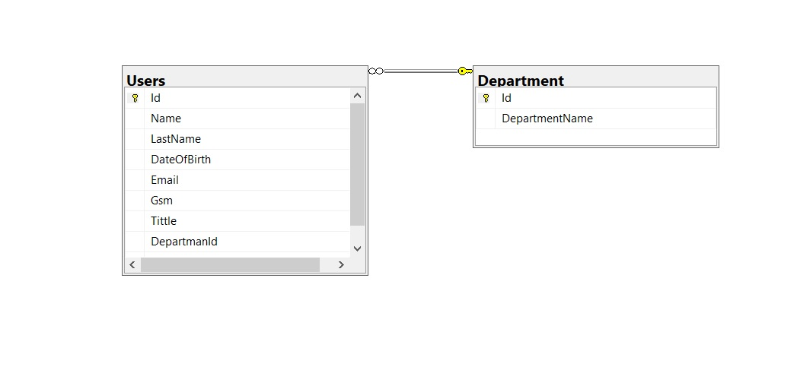

UserManagement proje
--------------------------------------------------------------------

## Yapılanlar

* Şekilde gözüktüğü gibi bir ilişki kurarak veri tabanı bağlantını oluşturdum . 

* Bağlantı için connection stringi appsetting.json içerisinde tanımladım. Ve DbOperations sınıfında Configirationsu kullanarak SqlConnectionu kullandım. 

* DataAcces Layerde Pür db işlemlerini gerçekleştirdim Ek kontrol veya diğer işlemler için Businesta UserService'i Kullanıyorum. Onunda içinde DbOperationsu dependency injection kullanarak businesta kullandım. 
  
* Listeleme harici Db işlemlerini execute methodunu kullanarak listeleme işlemlerini query kullanarak gerçekleştirdim. 

* Silme işleminde fiziksel olarak veri tabanından bir silme gerçekleşmeyeceği için controller'da httpDelete methodu yerine sadece bir alan değişeceğinden HttpPatch kullandım . 

